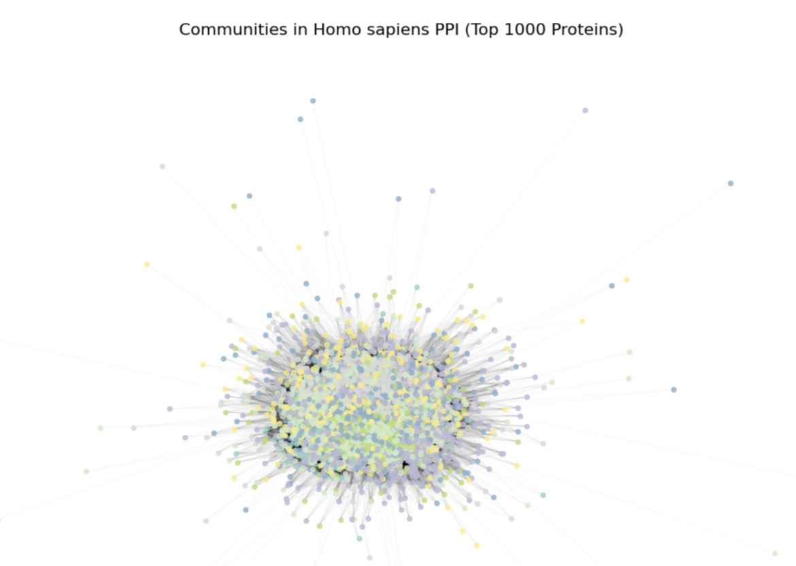
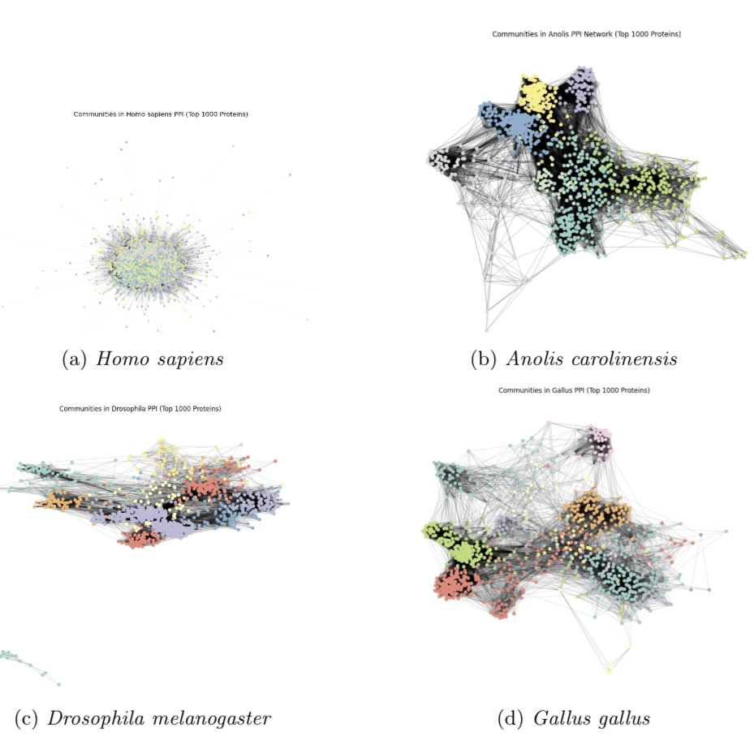
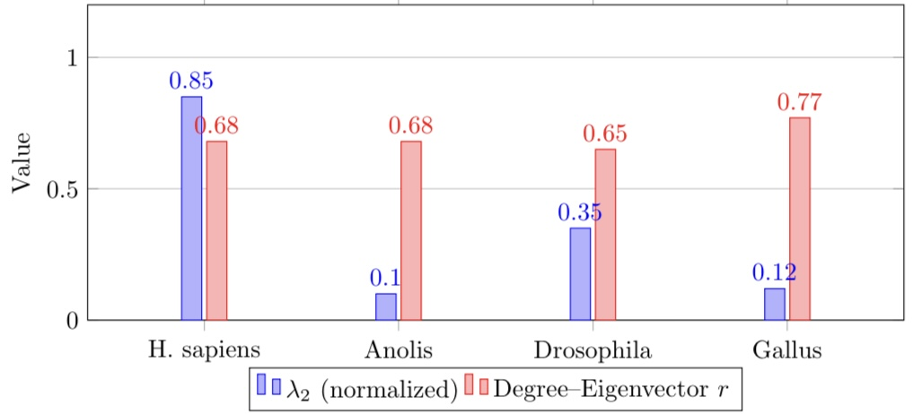
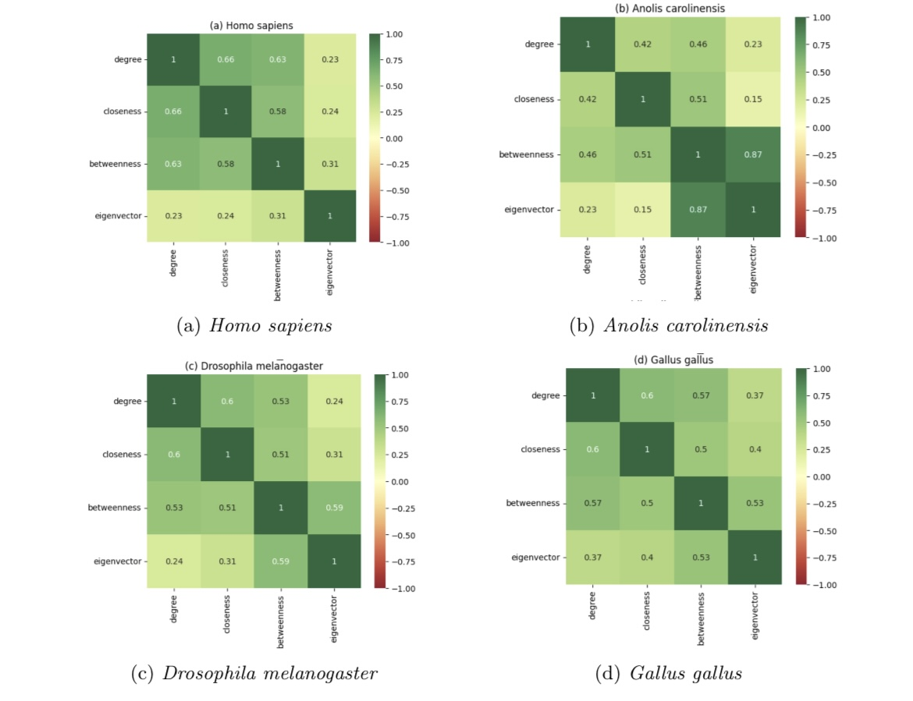
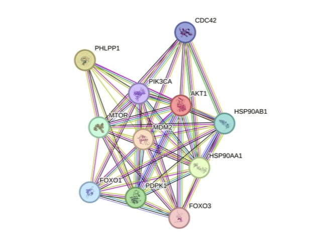

# Protein-Protein Interaction (PPI) Network Analysis of Four Model Organisms

A comparative network science study of high-confidence protein-protein interaction networks across four species: *Homo sapiens*, *Anolis carolinensis*, *Drosophila melanogaster*, and *Gallus gallus*, using STRING database interactions, NetworkX, and Louvain community detection.

## Overview

This project builds and analyzes PPI networks (1,090 proteins each, STRING confidence ≥ 0.7) to explore how connectivity, modularity, and hub structure differ across species — and what that means for their use in biomedical vs. evolutionary research.

**Key techniques:**
- Network construction from STRING interaction data (pandas, NetworkX)
- Centrality analysis: degree, betweenness, closeness, eigenvector
- Community detection via the Louvain algorithm
- Spectral analysis using the normalized Laplacian (algebraic connectivity, λ2)
- Biological interpretation via STRING functional enrichment

## Key Results

| Species          | Nodes | Edges | Avg. Degree | λ2   | Top Protein             |
|------------------|-------|-------|-------------|------|--------------------------|
| H. sapiens       | 1090  | 2436  | 4.87        | High | AKT1 (Rank 3)            |
| A. carolinensis  | 1090  | 1770  | 3.54        | Low  | LOC103252285 (Rank 1)   |
| D. melanogaster  | 1090  | 1877  | 3.63        | Low  | RpL40 (Rank 1)           |
| G. gallus        | 1090  | 1832  | 3.66        | Low  | MRTO4 (Rank 4)           |

- **Humans** show the highest algebraic connectivity (λ2), reflecting a dense, cohesive network well-suited to disease-gene prioritization and drug target discovery.
- **Anolis** and **Gallus** show low λ2, pointing to modular, loosely connected architectures — useful models for evolutionary adaptation studies.
- Across all species, degree and eigenvector centrality are strongly correlated (r = 0.65–0.77), confirming that highly connected proteins consistently act as influential hubs, regardless of species.
- Betweenness centrality correlates weakly with other measures in every network, suggesting it captures a distinct role — proteins that control information flow rather than simply being well-connected.

## Figures

**Community structure of the human PPI network:**

**Cross-species community structure comparison:**

**Algebraic connectivity (λ2) vs. degree-eigenvector correlation across species:**

**Cross-species centrality correlation heatmaps:**

**STRING interaction network for AKT1 (human hub protein):**

## Methods Summary

1. Downloaded `protein.links.txt` from STRING (v11.5) for each species, filtered to confidence score ≥ 700.
2. Built undirected networks in NetworkX; removed self-loops/multi-edges; retained the largest connected component.
3. Computed degree, betweenness (approximated with k=300 sampled sources), closeness, and eigenvector centrality.
4. Ran Louvain community detection to identify functional modules.
5. Computed the normalized graph Laplacian and extracted the Fiedler value (λ2) to assess connectivity/modularity.
6. Cross-referenced top hub proteins with STRING functional enrichment (GO terms) for biological interpretation.

## References

- Szklarczyk, D. et al. (2019). STRING v11: protein–protein association networks with increased coverage. *Nucleic Acids Research*, 47(D1), D607–D613.
- Blondel, V. D. et al. (2008). Fast unfolding of communities in large networks. *J. Stat. Mech.*, 2008(10), P10008.
- Hagberg, A. A. et al. (2008). Exploring network structure, dynamics, and function using NetworkX. *SciPy2008*.
- Barabási, A.-L., & Oltvai, Z. N. (2004). Network biology: understanding the cell's functional organization. *Nature Reviews Genetics*, 5(2), 101–113.

## Author

Yamna Siddiqi
